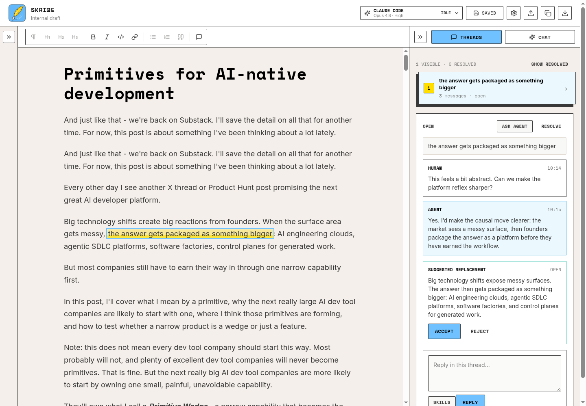
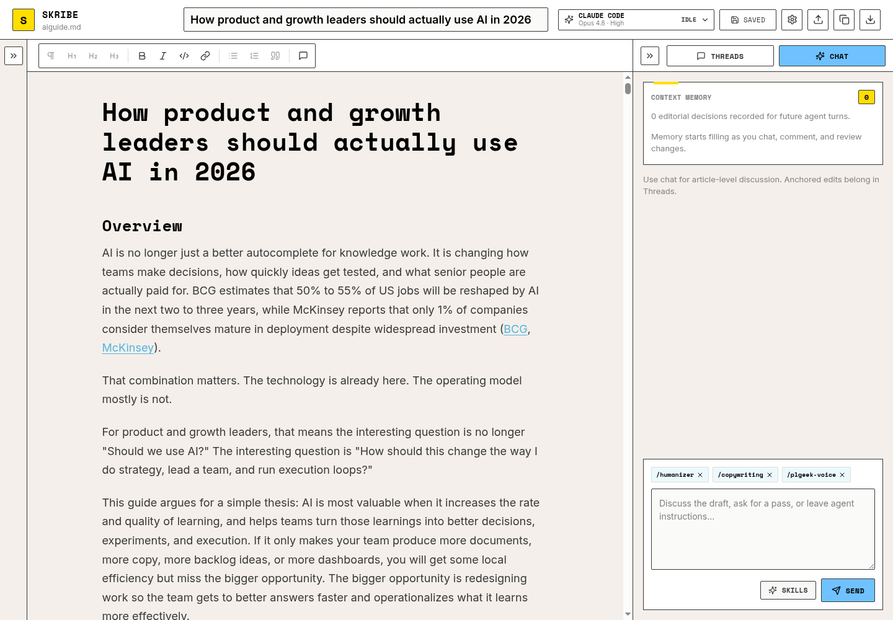
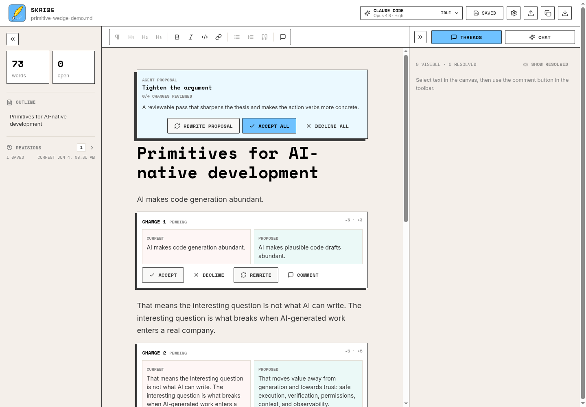
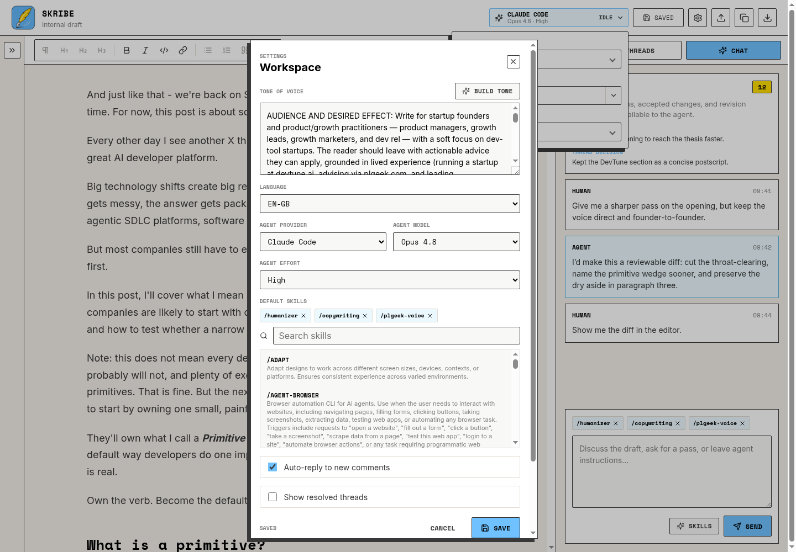

<p align="center">
  
</p>

# Skribe

Local-first Markdown writing with an AI review partner.

Skribe gives you an editable Markdown canvas, anchored comment threads, chat, reviewable diffs, revision history, and clean Markdown export. The document stays local. Review state stays local.

**Bring your own AI subscription.** Skribe uses the native agent CLIs you already have installed, such as Codex CLI or Claude Code. If your local CLI is signed in and working, Skribe can use it.

[](LICENSE)


## Why Skribe?

Most AI writing tools treat long-form editing as a chat transcript. That gets clunky fast.

Skribe is built around the document:

- **Editable rendered Markdown canvas** with headings, links, images, lists, quotes, code, GFM tables, copy/paste, and keyboard shortcuts.
- **Anchored comment threads** for paragraph-level or selection-level review.
- **Document chat** for broader passes, structural edits, and agent collaboration.
- **Agent skills** for reusable writing passes such as voice, humanising, copyediting, newsletter review, or any local skill your CLI runtime already knows about.
- **Reviewable diffs** in split or unified view, so agent edits can be accepted, declined, or revised before they touch the draft.
- **Per-document context memory** so previous comments, decisions, accepted changes, and revision requests stay available to the agent.
- **Local-only storage** for the Markdown file, review state, settings, revisions, and sidecars.
- **Local image assets** from inserted, pasted, or dropped images, stored beside the active Markdown document and referenced with normal Markdown image syntax.
- **Provider-agnostic agent runtime** with support for Codex CLI, Claude Code, or automatic runtime selection using your existing CLI authentication and provider plan.

## Threads vs Chat

Skribe has two agent conversation surfaces because they serve different editorial jobs.

| Surface | Use it for | What the agent sees |
| --- | --- | --- |
| **Threads** | Anchored comments on selected text, paragraph-level rewrites, local clarification, and focused suggestions. | The selected passage, the thread history, relevant document context, and previous decisions. |
| **Chat** | Article-level discussion, broad review passes, structural edits, skill-driven rewrites, and document-level diffs. | The wider document, chat history, context memory, open proposals, thread decisions, and selected skills. |

Use Threads when the question belongs to a specific passage. Use Chat when the question belongs to the whole draft.

## Skills

Skribe treats skills as reusable instructions for the agent.

It discovers local `SKILL.md` files from:

- `~/.agents/skills`
- `~/.claude/skills`
- `~/.codex/skills`
- `~/.codex/plugins/cache`
- Any extra directories listed in `SKRIBE_SKILL_ROOTS`

Skills show up in the chat and thread composers. You can click **Skills** to browse them, type `/skill-name` for autocomplete, or set favourite defaults in Settings.

When you send a message, Skribe passes the selected skills to the active agent runtime. The native CLI is then instructed to load and follow those local skill instructions before replying. That keeps the integration provider-agnostic: Codex CLI, Claude Code, and future runtimes can use the same Skribe UI while relying on their own local skill support.

Skills describe *how* the agent should work. The current surface decides *where* that work should focus.

| Surface | Skill scope |
| --- | --- |
| **Thread** | The anchored selection or passage is the focus. The agent also sees enough document context and previous decisions to make the local edit fit. |
| **Chat** | The whole draft is the default focus, especially for broad review passes, structural rewrites, and skill-only requests. |

For example, `/humanizer` in a thread should humanise the selected passage and usually return a focused reply or replacement suggestion. `/humanizer` in Chat should treat the current draft as the writing context and, when useful, return a reviewable document proposal. Your wording can narrow or widen the scope: "use `/humanizer` on the intro only" keeps the edit focused, while "use `/humanizer` across the whole piece" asks for a broader pass.

Default skills are just preselected skills for new chat messages and new comment threads. They do not run in the background; they apply only when you send that message.

You can also send a skill by itself:

```text
/humanizer
```

In that case Skribe asks the agent to apply the skill to the current writing context and return reviewable suggestions or document proposals when edits are useful.

To add another skill directory:

```bash
SKRIBE_SKILL_ROOTS=~/company/skills:~/personal/skills skribe ~/draft.md
```

## Screenshots

### Editor

Rendered Markdown stays editable, with a compact toolbar and collapsible sidebars.


### Threads

Anchor comments to highlighted passages, discuss the local edit, and review focused replacement suggestions.



### Chat

Use chat for article-level discussion, skill-driven passes, and reviewable document diffs.



### Diff Review

Review proposed document changes inline, then accept, decline, rewrite, or comment on each change block. Choose split view for side-by-side current/proposed text, or unified view for compact `-` and `+` lines.



### Settings

Persist writing preferences, theme, document font, agent runtime, model, effort, default skills, diff view, and workspace defaults.



## Quick Start

Requirements:

- Node.js 20 or newer
- `npm`
- Optional: Codex CLI or Claude Code if you want live agent replies from your existing provider subscription

Run without installing:

```bash
npx skribe-editor ~/draft.md
```

Or install globally:

```bash
npm install -g skribe-editor
skribe ~/draft.md
```

Skribe starts a local server and prints the browser URL.

## Opening Multiple Documents

Skribe runs one local app instance and keeps one document open at a time.

The first command starts the local server:

```bash
skribe ~/draft-one.md
```

If Skribe is already running, another command hands the new file to the existing server instead of starting a second server:

```bash
skribe ~/draft-two.md
```

The existing browser tab switches to `draft-two.md`, and the second terminal command exits after printing the running app URL. The previous document is saved before the switch, and each Markdown file keeps its own comments, chat, proposals, revisions, and agent session sidecar state.

If an agent turn is running, Skribe will not switch documents until that turn finishes. This prevents an agent response from being applied to the wrong draft.

If port `4327` is already used by another app, Skribe prints a clear port conflict message. Use a different port if needed:

```bash
PORT=4330 skribe ~/draft.md
```

## Run From Source

Clone and run:

```bash
git clone git@github.com:devtunehq/skribe.git
cd skribe
npm install
npm run build
npm run serve
```

Open [http://127.0.0.1:4327](http://127.0.0.1:4327).

## Open A Markdown File

Run Skribe against a specific file:

```bash
npm run serve -- ~/draft.md
```

Or link the local CLI:

```bash
npm link
skribe ~/draft.md
```

Skribe keeps the `.md` file as the clean document source. Comments, chat, proposals, revisions, and agent memory are stored in a sidecar directory under the local Skribe config directory.

## Agent Runtime

Skribe invokes an external CLI behind the scenes. It does not hard-code one model provider.

That means your normal CLI setup still owns authentication, model access, limits, and billing. Use Codex CLI if that is where you work. Use Claude Code if that is where you work. Leave Skribe on `auto` if you want it to pick the first healthy local runtime.

```bash
SKRIBE_AGENT_RUNTIME=auto npm run serve -- ~/draft.md
SKRIBE_AGENT_RUNTIME=claude SKRIBE_AGENT_MODEL=opus SKRIBE_AGENT_EFFORT=high npm run serve -- ~/draft.md
SKRIBE_AGENT_RUNTIME=codex SKRIBE_AGENT_MODEL=gpt-5 npm run serve -- ~/draft.md
```

Supported runtime values:

- `auto` - pick the first healthy local CLI from `SKRIBE_AGENT_RUNTIME_PRIORITY`
- `codex` - use Codex CLI
- `claude` - use Claude Code
- `stub` - deterministic local responses for development and tests

Useful environment variables:

| Variable | Purpose |
| --- | --- |
| `PORT` | Server port. Defaults to `4327`. |
| `SKRIBE_CONFIG_DIR` | Config root. Defaults to `~/.config/skribe`. |
| `SKRIBE_DATA_DIR` | Local document/review storage root. Defaults to `~/.config/skribe/data`. |
| `SKRIBE_DOCUMENT` / `SKRIBE_DOCUMENT_PATH` | Markdown file to open when no CLI path is passed. |
| `SKRIBE_AGENT_RUNTIME` | `auto`, `codex`, `claude`, or `stub`. |
| `SKRIBE_AGENT_RUNTIME_PRIORITY` | Comma-separated runtime order for `auto`. Defaults to `codex,claude`. |
| `SKRIBE_AGENT_MODEL` | Model id, or `auto` to let the selected CLI decide. |
| `SKRIBE_AGENT_EFFORT` | Reasoning effort where supported. |
| `SKRIBE_AGENT_TIMEOUT_MS` | Agent command timeout. Defaults to 10 minutes. |
| `SKRIBE_SKILL_ROOTS` | Additional skill roots for slash-command style skills. |

You can also change runtime, model, effort, language, document font, theme, tone, default skills, split/unified diff view, and review preferences from the settings panel.

## Storage Model

Skribe keeps one active document in memory for fast editing, then checkpoints to disk.

Default local document:

```text
~/.config/skribe/data/docs/default/draft.md
~/.config/skribe/data/docs/default/review.json
~/.config/skribe/data/docs/default/session.json
~/.config/skribe/data/docs/default/snapshots/
```

External Markdown file:

```text
~/draft.md
~/.config/skribe/data/external/<doc-id>/review.json
~/.config/skribe/data/external/<doc-id>/session.json
~/.config/skribe/data/external/<doc-id>/snapshots/
```

Global settings live at:

```text
~/.config/skribe/settings.json
```

## Development

Run the server:

```bash
npm run serve
```

Run the Vite dev server separately:

```bash
npm run dev
```

Validation:

```bash
npm test
npm run typecheck
npm run build
```

## Project Status

Skribe is early and intentionally local-first. It is useful today for Markdown drafting and AI-assisted review, but the editor and agent workflow are still being hardened. The source is public for transparency and local use, but external contributions are not open at this stage.

## License

MIT. See [LICENSE](LICENSE).
